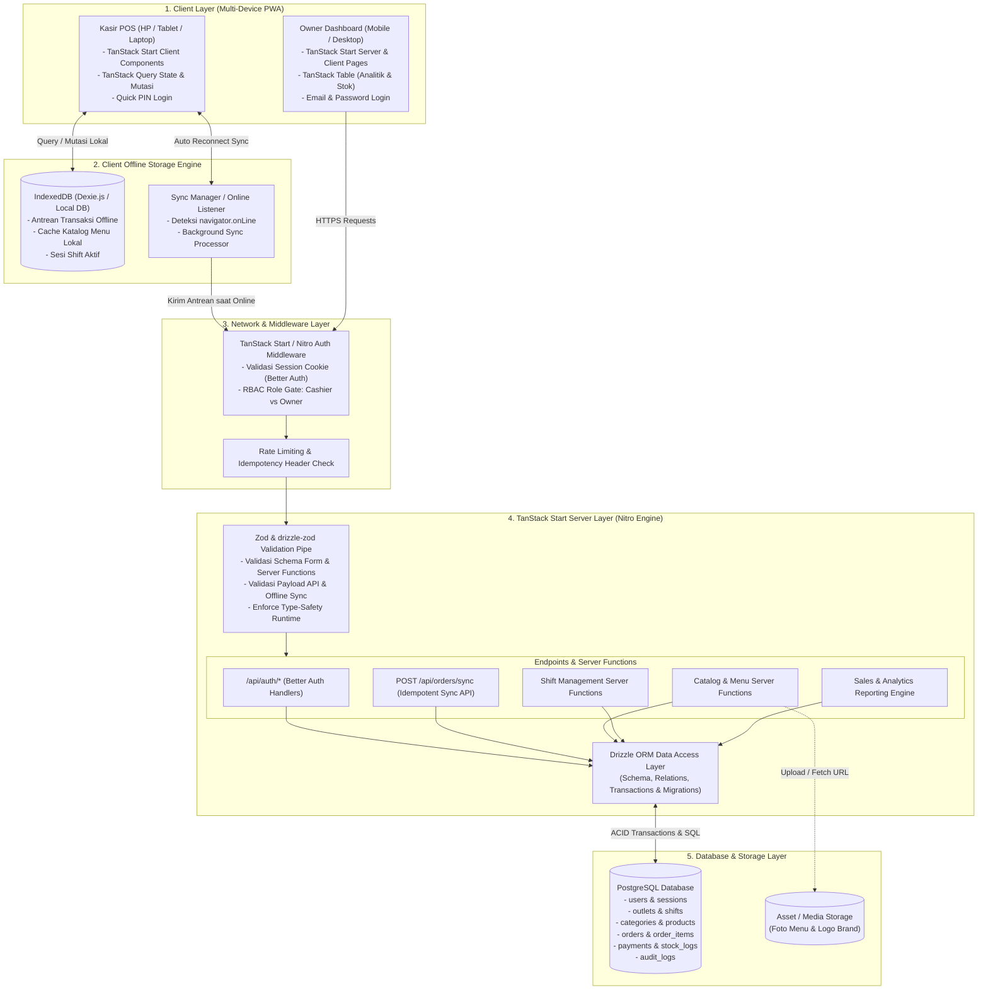
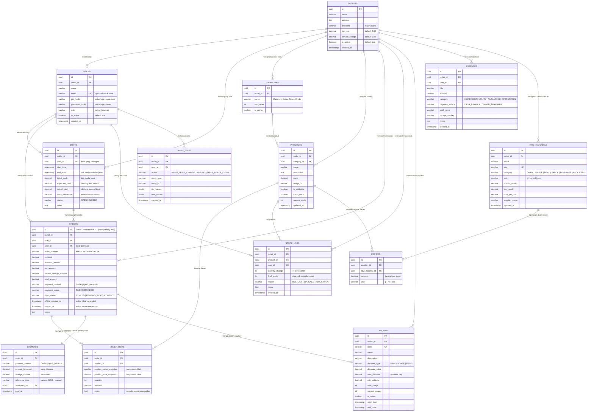
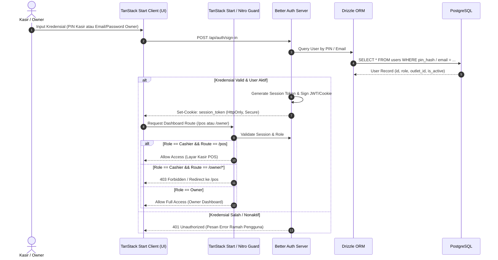
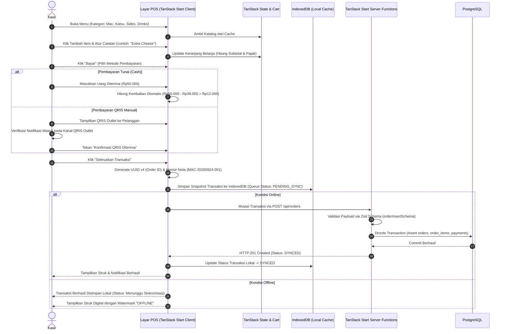
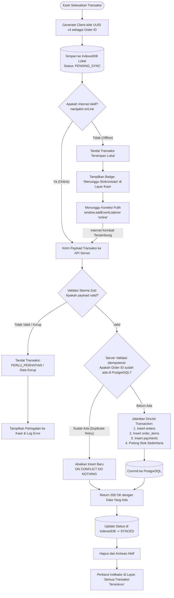
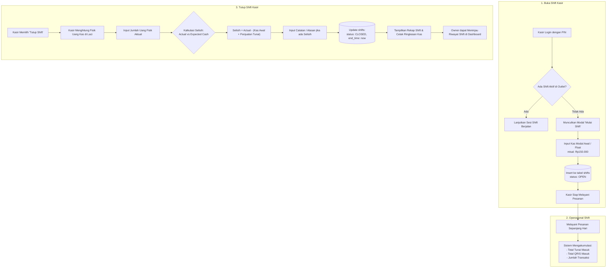

# PRD — MacMood POS (Point of Sale)

**Status:** Dokumen Spesifikasi Produk & Arsitektur Teknis (Fase 1 & Fase 2 UI/State/Verifikasi Selesai -> Siap Implementasi Backend & Integrasi Database)  
**Bahasa Produk & Antarmuka:** Bahasa Indonesia  
**Target Rilis:** MVP 1 Outlet (dengan arsitektur siap scale ke Multi-Outlet)  
**Terakhir Diperbarui:** 24 September 2026 (Refleksi Implementasi Kasir, Owner Suite, & Fase 2)  

---

## 1. Ringkasan Produk

**MacMood** adalah brand UMKM Food & Beverage (FnB) yang berfokus pada menu olahan *mac and cheese*. Sajian MacMood mengombinasikan makaroni keju gurih dengan pendamping seperti chicken katsu dan kentang (*french fries*). 

**MacMood POS** adalah aplikasi sistem kasir dan manajemen operasional outlet berbasis web modern (*Progressive Web App* / PWA) yang dapat diakses secara fleksibel dari berbagai perangkat (Smartphone kasir, Tablet operasional kasir, maupun Laptop/Desktop Owner).

### Karakteristik Inti Sistem
1. **Offline-First Resilience:** Outlet FnB UMKM rentan terhadap koneksi internet yang putus-nyambung (*flaky network*). Kasir harus tetap bisa melayani pesanan dan menyelesaikan pembayaran secara offline tanpa hambatan. Transaksi disimpan di antrean lokal (*IndexedDB*) dan disinkronkan secara aman (*idempotent sync*) begitu internet kembali pulih.
2. **Kecepatan Transaksi Kasir (High-Efficiency POS):** Alur pemesanan *tap-to-cart*, kalkulasi kembalian otomatis, dan konfirmasi metode pembayaran dalam waktu singkat (< 60 detik per transaksi).
3. **Pemisahan Peran yang Ketat (RBAC):** Kasir fokus pada transaksi harian dan shift; Owner memiliki visibilitas penuh atas laporan penjualan, katalog produk, stok sederhana, dan audit log.
4. **Metode Pembayaran MVP:** Tunai (dengan kalkulator kembalian) dan QRIS Statis/Dinamis (dengan konfirmasi manual kasir).

---

## 2. Masalah dan Peluang Bisnis

| Aspek | Kondisi Eksisting / Manual | Solusi MacMood POS |
|---|---|---|
| **Pencatatan Penjualan** | Nota kertas atau rekap manual berisiko hilang, salah hitung, dan memakan waktu tutup buku di akhir hari. | Pencatatan otomatis tersimpan per shift dengan rekapitulasi penjualan kotor, bersih, dan metode pembayaran. |
| **Konektivitas Outlet** | Gangguan internet sering membuat kasir tidak bisa memakai POS berbasis cloud murni. | Arsitektur *Offline-First* dengan antrean transaksi lokal persisten di browser (*IndexedDB*) dan sinkronisasi otomatis. |
| **Kontrol Uang Kas** | Selisih kas fisik (*cash float*) dan penjualan tunai sulit ditelusuri per kasir. | Fitur *Shift Management* wajib: catat kas awal, hitung kas akhir, dan kalkulasi selisih secara transparan. |
| **Pengawasan Owner** | Owner harus datang ke outlet atau menunggu kasir mengirim foto nota rekap harian. | Dashboard analitik real-time yang dapat diakses kapan saja dari HP atau laptop owner. |

---

## 3. Spesifikasi Arsitektur & Tech Stack

Sistem MacMood POS dirancang dengan stack teknologi modern, *type-safe*, berperforma tinggi, dan ramah terhadap kapabilitas *offline-first*.

### 3.1 Ringkasan Komponen Stack

```
+----------------------------------------------------------------------------------+
|                                MACMOOD POS STACK                                 |
+------------------------------------+---------------------------------------------+
| Layer                              | Teknologi yang Digunakan                    |
+------------------------------------+---------------------------------------------+
| Fullstack Framework & Runtime      | TanStack Start (@tanstack/react-start,      |
|                                    | @tanstack/react-router, Nitro Server, Vite) |
+------------------------------------+---------------------------------------------+
| Database Relasional                | PostgreSQL (ACID Compliant, Row Locking)    |
+------------------------------------+---------------------------------------------+
| ORM & Database Migration           | Drizzle ORM + Drizzle Kit (Type-safe SQL)   |
+------------------------------------+---------------------------------------------+
| Authentication & Access Control    | Better Auth (Session Cookie, RBAC, PIN/Pass)|
+------------------------------------+---------------------------------------------+
| Client State & Data Management     | TanStack Ecosystem:                         |
|                                    | - TanStack Start / Router (Server Functions)|
|                                    | - TanStack Query (Data Caching & Sync)      |
|                                    | - TanStack Table (Data Grid & Laporan)      |
+------------------------------------+---------------------------------------------+
| Client Storage & PWA (Offline)     | IndexedDB (via Dexie.js / idb) + Web Worker |
+------------------------------------+---------------------------------------------+
| Schema Validation & Type Safety    | Zod + drizzle-zod (End-to-End Type Safety,  |
|                                    | Runtime Validation, Form & API Schemas)     |
+------------------------------------+---------------------------------------------+
| Styling & UI Tokens                | Tailwind CSS v4 + MacMood Design System     |
+------------------------------------+---------------------------------------------+
```

### 3.2 Rationale Pemilihan Teknologi

1. **TanStack Start Fullstack Framework:**
   - Framework fullstack React modern berbasis `@tanstack/react-start` dan `@tanstack/react-router` yang ditenagai Nitro server engine dan Vite bundler berkecepatan tinggi.
   - Memberikan *type-safety* 100% dari URL routing, search params, data loader, hingga Server Functions (`createServerFn`).
   - Menyederhanakan penanganan SSR dan API handlers untuk endpoint sinkronisasi transaksi offline dalam arsitektur yang sangat ringan dan responsif.
2. **PostgreSQL:**
   - Standar emas untuk integritas transaksi finansial UMKM dengan dukungan transaksi ACID, constraint relasional yang ketat, dan locking tingkat baris untuk mencegah *race condition* pada stok dan shift.
3. **Drizzle ORM:**
   - TypeScript-first ORM dengan *zero overhead* dan performa mendekati raw SQL.
   - Skema tabel didefinisikan sebagai kode TypeScript murni, mempermudah migrasi via Drizzle Kit dan memberikan *type-safety end-to-end* dari database hingga komponen UI.
4. **Better Auth:**
   - Solusi autentikasi modern yang terintegrasi erat dengan TanStack Start dan Drizzle ORM.
   - Mendukung sesi berbasis cookie HTTP-Only yang aman, proteksi brute-force, serta fleksibilitas login via PIN cepat untuk kasir di outlet dan Email/Password untuk owner.
   - Dilengkapi sistem *Role-Based Access Control* (RBAC) bawaan untuk membedakan hak akses `owner` vs `cashier`.
5. **TanStack Ecosystem (Router, Query, Table, Start):**
   - **TanStack Router & Start:** Manajemen rute tipe-aman (*strictly typed routes*) dengan preloading dan error boundaries bawaan.
   - **TanStack Query:** Mengelola *server state*, cache katalog menu, mutasi transaksi dengan *optimistic updates*, dan antrean *mutation retry* saat internet tersambung kembali.
   - **TanStack Table:** Menyajikan tabel data berkecepatan tinggi dengan fitur filter multi-kolom, sorting, dan pagination pada halaman riwayat transaksi dan audit stok di dashboard owner.
6. **IndexedDB & Service Worker:**
   - Menyimpan seluruh transaksi yang dibuat saat offline di *storage* lokal browser kasir yang persisten (tidak terhapus saat refresh atau browser ditutup), lengkap dengan status antrean.
7. **Zod & drizzle-zod (Runtime Validation & End-to-End Type Safety):**
   - Menjamin integritas data sebelum menyentuh logika bisnis atau database via *runtime validation* pada seluruh form input client, Server Functions, dan API Route Handlers.
   - Menggunakan `drizzle-zod` (`createInsertSchema`, `createSelectSchema`) untuk menghasilkan skema validasi otomatis langsung dari tabel Drizzle ORM tanpa duplikasi kode (*DRY principle*).
   - Memvalidasi muatan data (*payload*) antrean sinkronisasi offline dari IndexedDB agar bebas dari data korup sebelum diproses oleh database PostgreSQL.
   - Memvalidasi variabel lingkungan (*environment variables*) aplikasi secara aman (`DATABASE_URL`, `BETTER_AUTH_SECRET`, dll.).

---

## 4. Diagram Arsitektur Sistem (System Architecture)

Diagram berikut mengilustrasikan arsitektur multi-layer MacMood POS, mulai dari perangkat kasir/owner hingga database PostgreSQL.



---

## 5. Skema Database Relasional (Drizzle ORM & PostgreSQL)

Berikut adalah Entity Relationship Diagram (ERD) lengkap yang dimodelkan menggunakan Drizzle ORM pada PostgreSQL.



---

## 6. Autentikasi & Kontrol Akses (Better Auth & RBAC)

Sistem menggunakan **Better Auth** dengan pemisahan kredensial yang disesuaikan dengan lingkungan kerja outlet:
- **Kasir:** Login cepat menggunakan **PIN 4–6 digit**. Di tablet kasir yang digunakan bergantian, PIN mempercepat pergantian shift tanpa perlu mengetik email/password panjang.
- **Owner/Admin:** Login aman menggunakan **Email & Password** (dengan proteksi session token berbasis HTTP-Only Secure Cookies).

### 6.1 Matriks Hak Akses (RBAC)

| Kemampuan / Fitur | Kasir (Cashier) | Owner / Admin |
|---|:---:|:---:|
| Buka / Tutup Shift Kasir | ✅ | ✅ |
| Buat Pesanan & Tambah Keranjang | ✅ | ✅ |
| Proses Pembayaran Tunai & QRIS Manual | ✅ | ✅ |
| Simpan Transaksi Offline & Sinkronisasi | ✅ | ✅ |
| Cetak / Tampilkan Ulang Bukti Transaksi Shift Sendiri | ✅ | ✅ |
| Ubah Harga Menu atau Hapus Menu | ❌ | ✅ |
| Kelola Akun Staf & Reset PIN | ❌ | ✅ |
| Lihat Ringkasan Laporan Penjualan Semua Shift | ❌ | ✅ |
| Melakukan Pembatalan / Refund Transaksi Selesai | ❌ (Wajib Otorisasi) | ✅ |
| Koreksi Stok & Riwayat Mutasi Bahan/Menu | ❌ | ✅ |
| Mengubah Pengaturan Pajak / Outlet | ❌ | ✅ |

### 6.2 Alur Autentikasi & Autorisasi (Sequence Diagram)



---

## 7. Diagram Alur Transaksi Kasir (Order & Checkout Flow)

Alur berikut menjelaskan tahapan kasir dari pemilihan menu hingga pencatatan bukti transaksi.



---

## 8. Diagram Alur Offline-First & Sinkronisasi Idempoten

Salah satu keunggulan utama MacMood POS adalah ketahanan terhadap internet yang terputus tanpa risiko transaksi ganda (*double recording*).



---

## 9. Diagram Alur Manajemen Shift Kasir

Manajemen shift menjamin akuntabilitas uang fisik di laci kasir terhadap total transaksi tunai yang tercatat di sistem.



---

## 10. Kebutuhan Fungsional MVP (Functional Requirements)

Katalog menu awal berfokus pada varian **Mac and Cheese MacMood**, produk pendamping (**Chicken Katsu**, **French Fries/Kentang**), serta minuman.

| ID | Prioritas | Fitur | Kriteria Penerimaan (Acceptance Criteria) | Status Implementasi |
|---|:---:|---|---|:---:|
| **FR-01** | **P0** | Autentikasi Staf & RBAC (Better Auth) | - Kasir login cepat menggunakan PIN.<br/>- Owner login menggunakan Email & Password.<br/>- Kasir diblokir dari rute admin dan server actions master. | ✅ UI & Auth Guard Selesai |
| **FR-02** | **P0** | Buka & Tutup Shift Kasir | - Kasir wajib mengisi kas modal awal sebelum transaksi pertama dimulai.<br/>- Ringkasan shift menampilkan total tunai, QRIS, dan kalkulasi selisih kas fisik secara transparan. | ✅ UI & Modal Shift Selesai |
| **FR-03** | **P0** | Katalog Menu & Manajemen Produk | - Owner dapat menambah, mengedit, menonaktifkan menu, dan mengubah harga.<br/>- Status ketersediaan (*Tersedia / Habis*) langsung terefleksi di layar kasir. | ✅ UI & Master Menu Selesai |
| **FR-04** | **P0** | Pemilihan Menu & Keranjang Belanja | - Kasir dapat mencari menu via search bar dan memfilter berdasarkan kategori.<br/>- Item dalam keranjang dapat disesuaikan kuantitasnya dan diberi catatan pesanan. | ✅ UI & POS Cart Selesai |
| **FR-05** | **P0** | Pembayaran Tunai & QRIS Manual | - Pembayaran tunai menghitung nominal kembalian otomatis.<br/>- Pembayaran QRIS mewajibkan konfirmasi manual kasir sebelum pesanan dianggap lunas. | ✅ UI & Checkout Selesai |
| **FR-06** | **P0** | Struk Digital & Bukti Transaksi | - Menghasilkan nomor transaksi unik format `MAC-YYYYMMDD-XXXX`.<br/>- Menampilkan rincian item, subtotal, diskon, pajak PB1, metode bayar, dan status sinkronisasi. | ✅ UI & Thermal Struk Selesai |
| **FR-07** | **P0** | Transaksi Offline & Sinkronisasi Idempoten | - Transaksi saat internet terputus tersimpan otomatis di IndexedDB/State.<br/>- Saat internet pulih, antrean otomatis disinkronkan ke server tanpa terjadi transaksi ganda (*idempotent*). | ⏳ Siap Integrasi Backend |
| **FR-08** | **P0** | Executive Dashboard & Analitik Owner | - Owner memantau tren Bézier kurva omzet vs kemarin, donut chart kategori & pembayaran, dan kartu rekomendasi pintar.<br/>- Menampilkan metrik: Penjualan Bersih, HPP (COGS), Laba Kotor, AOV, Petty Cash, dan Top Sellers dinamis. | ✅ UI & Analytics Selesai |
| **FR-09** | **P0** | Manajemen Stok Sederhana | - Owner dapat mencatat stok fisik menu jadi dan melihat peringatan stok menipis.<br/>- Setiap mutasi stok tercatat di `stock_logs` dengan alasan (*restock*, *spoilage*, *adjustment*). | ✅ UI Master Stok Selesai |
| **FR-10** | **P1** | Pengaturan Outlet & Parameter Pajak | - Konfigurasi nama outlet, alamat, zona waktu, persentase pajak (PB1 10%), dan service charge. | ✅ UI & Config Selesai |
| **FR-11** | **P1** | Pembatalan / Void Transaksi Terkendali | - Transaksi selesai tidak dapat dihapus sembarangan.<br/>- Pembatalan transaksi wajib menyertakan alasan pembatalan dan otorisasi PIN/Password Owner. | ✅ UI & Log Void Selesai |
| **FR-12** | **P1** | Rekap Shift & Laci Kas Fisik (`?tab=shifts`) | - Riwayat pergantian shift, pencatatan uang fisik laci kas aktual, kalkulasi selisih (*variance*), dan cetak struk shift. | ✅ UI & State Selesai |
| **FR-13** | **P1** | Biaya Operasional / Kas Kecil (`?tab=expenses`) | - Pencatatan pengeluaran operasional mendesak (es batu, gas LPG, kresek, dll.), filter kategori/sumber dana, dan ekspor CSV. | ✅ UI & State Selesai |
| **FR-14** | **P1** | Log Audit Keamanan Outlet (`?tab=audit-logs`) | - Pencatatan jejak audit (harga, void, reset PIN, voucher, resep, restock) dengan data *before vs after*. | ✅ UI & Logger Selesai |
| **FR-15** | **P1** | Diskon, Voucher & Promo Dinamis (`?tab=promos`) | - Manajemen voucher kupon (% dan Rp), batas min-order, cap maksimal diskon, kuota, tanggal aktif, switch on/off, dan integrasi picker voucher di kasir POS. | ✅ UI & POS Integrasi Selesai |
| **FR-16** | **P1** | Manajemen Resep & Bahan Baku Mentah BOM (`?tab=recipes`) | - Dual tab BOM per porsi & Master Bahan Baku Mentah (g, kg, ml, pcs), kalkulasi otomatis HPP modal, gross margin %, dan batas porsi tersedia. | ✅ UI & BOM Editor Selesai |

---

## 11. Spesifikasi Laporan & Metrik Finansial

Formula baku yang digunakan pada modul analitik owner:

1. **Penjualan Kotor (Gross Sales):**  
   $$\text{Gross Sales} = \sum (\text{Qty Item} \times \text{Harga Snapshot Satuan})$$
2. **Penjualan Bersih (Net Sales):**  
   $$\text{Net Sales} = \text{Gross Sales} - \text{Total Diskon}$$
3. **Total Penerimaan Bersih:**  
   $$\text{Total Transaksi} = \text{Net Sales} + \text{Pajak} + \text{Service Charge}$$
4. **Rata-Rata Nilai Transaksi (Average Order Value / AOV):**  
   $$\text{AOV} = \frac{\text{Net Sales}}{\text{Jumlah Transaksi Berhasil}}$$
5. **Menu Terlaris (Top Selling Items):**  
   Diurutkan berdasarkan kuantitas item terjual terbanyak dalam periode waktu terpilih, dengan metrik sekunder total kontribusi nominal rupiah.
6. **Selisih Kas Shift (Cash Variance):**  
   $$\text{Selisih Kas} = \text{Uang Fisik Dihitung Kasir} - (\text{Kas Awal} + \text{Total Pembayaran Tunai})$$

---

## 12. Kebutuhan Nonfungsional (NFR)

- **Performa Antarmuka:**  
  Interaksi pemilihan menu dan penambahan ke keranjang belanja memiliki latensi respon di bawah 50 milidetik (*optimistic client update* via TanStack Query).
- **Keamanan & Validasi Input:**  
  - Seluruh form input, argumen Server Actions, dan payload endpoint API diverifikasi ketat secara runtime menggunakan skema **Zod** (mencegah payload rusak, data tak terduga, dan *parameter tampering*).
  - PIN dan password disimpan dalam format hash aman (*Argon2id* atau *Bcrypt*).
  - Cookie sesi menggunakan flag `HttpOnly`, `SameSite=Lax`, dan `Secure`.
  - Akses database via Drizzle ORM menggunakan *parameterized queries* untuk mencegah ancaman SQL Injection.
- **Responsivitas & Kompatibilitas Form-Factor:**  
  - HP (< 600px): Tata letak vertikal dengan *bottom sheet* untuk keranjang belanja dan aksi bayar.
  - Tablet (600px – 1023px): Tampilan split-screen (katalog di kiri, keranjang tetap di kanan).
  - Laptop/Desktop (≥ 1024px): Dashboard multi-kolom untuk owner dengan sidebar navigasi.
- **Aksesibilitas & Keterbacaan:**  
  - Rasio kontras teks memenuhi standar WCAG 2.2 AA (minimal 4.5:1).
  - Target sentuh tombol kasir minimal berukuran 44 × 44 CSS pixel.
  - Angka nominal selalu diformat rapi dalam mata uang Rupiah (contoh: `Rp28.000`).

---

## 13. Manajemen Risiko & Strategi Mitigasi

| Risiko Potensial | Dampak | Strategi Mitigasi Teknis |
|---|:---:|---|
| **Internet Outlet Sering Putus** | Transaksi terhenti, antrean pembeli menumpuk. | Arsitektur *Offline-First* penuh: seluruh katalog dan antrean transaksi berada di IndexedDB lokal kasir. Transaksi tetap sukses dicatat tanpa koneksi. |
| **Transaksi Ganda saat Sinkronisasi** | Laporan penjualan menggelembung (*double counting*). | *Client-Side UUID Generation* sebagai Primary Key (`orders.id`). Server menggunakan klausa `ON CONFLICT (id) DO NOTHING` pada query Drizzle sehingga pengiriman berulang bersifat idempoten. |
| **Fraud Konfirmasi QRIS Palsu** | Kerugian finansial outlet (pesanan diserahkan tanpa uang masuk). | SOP internal yang jelas: kasir wajib mengecek mutasi masuk di rekening/aplikasi penerima QRIS sebelum menekan tombol konfirmasi. Tercatat identitas kasir yang memvalidasi. |
| **Perangkat Kasir Rusak / Cache Terhapus** | Transaksi offline yang belum tersinkron hilang. | Aplikasi memberikan peringatan visual tegas jika ada antrean pending, serta memicu auto-sync berkala setiap 30 detik saat ada sinyal internet. |
| **Perubahan Harga Berdampak pada Transaksi Lama** | Nilai transaksi historis berubah tidak sesuai nota pelanggan. | Tabel `order_items` mencatat snapshot nama dan harga saat transaksi terjadi (`product_name_snapshot` dan `product_price_snapshot`), independen dari tabel produk master. |

---

## 14. Roadmap Pengembangan

```mermaid
flowchart LR
    subgraph MVP["Fase 1: MVP Operasional 1 Outlet (Selesai UI & State)"]
        direction TB
        M1["✅ TanStack Start + Postgres + Drizzle + Zod"]
        M2["✅ Better Auth PIN & RBAC (Guard & Session)"]
        M3["✅ Kasir POS & Offline Cart Management"]
        M4["✅ Tunai, QRIS & Kalkulator Kembalian"]
        M5["✅ Laporan & Executive Analytics Dashboard"]
    end

    subgraph Phase2["Fase 2: Operasional Lanjutan (Selesai UI & State)"]
        direction TB
        P1["✅ Rekap Shift & Laci Kas Fisik"]
        P2["✅ Biaya Operasional / Kas Kecil (Petty Cash)"]
        P3["✅ Log Audit Keamanan Outlet"]
        P4["✅ Diskon, Voucher & Promo Dinamis"]
        P5["✅ Manajemen Resep & Bahan Mentah (BOM & HPP)"]
    end

    subgraph BackendPhase["Milestone Aktif: Integrasi Backend & Persistensi Data"]
        direction TB
        B1["Drizzle PostgreSQL Schema Migrations"]
        B2["Server Services & Zod Schema Validation"]
        B3["API Route Handlers & Server Functions"]
        B4["Integrasi Data POS & Admin ke PostgreSQL"]
    end

    subgraph Phase3["Fase 3: Multi-Outlet & Skalabilitas (Mendatang)"]
        direction TB
        S1["Multi-Branch Centralized Dashboard"]
        S2["Integrasi Payment Gateway QRIS Dinamis Otomatis"]
        S3["Customer Loyalty & Database Pelanggan"]
        S4["Pemesanan Mandiri via Meja (QR Order)"]
    end

    MVP --> Phase2 --> BackendPhase --> Phase3
```



---

## 15. Skenario Uji Penerimaan Utama (Acceptance Test Checklist)

1. **Uji Transaksi Normal Tunai:**  
   Kasir memilih menu "Classic Mac", memilih varian reguler, menambah catatan, input pembayaran uang pas atau lebih, aplikasi menghitung kembalian dengan tepat dan mencatat riwayat transaksi.
2. **Uji Transaksi Normal QRIS Manual:**  
   Kasir memilih menu, memilih QRIS, melakukan verifikasi eksternal, menekan konfirmasi, transaksi tercatat dengan identitas staf dan metode bayar QRIS.
3. **Uji Diskon & Voucher Promo:**  
   Kasir memasukkan kode promo atau memilih voucher (misal `MACMOOD10`), sistem memvalidasi batas minimum belanja, memotong subtotal, dan menghitung pajak PB1 10% dari sisa subtotal.
4. **Uji Manajemen Resep & HPP:**  
   Owner membuka tab resep, melihat perhitungan HPP otomatis berdasarkan harga beli bahan baku mentah, margin laba kotor, dan ketersediaan porsi menu yang dibatasi oleh stok bahan baku kritis (*bottleneck*).
5. **Uji Offline Penuh & Recovery:**  
   - Putuskan koneksi jaringan (matikan Wi-Fi / cabut LAN).
   - Kasir membuat 3 transaksi penjualan.
   - Verifikasi ketiga transaksi berstatus `PENDING_SYNC` di antrean lokal dan nota bertanda offline dapat ditampilkan.
   - Tutup tab browser dan buka kembali: antrean transaksi tidak hilang.
   - Sambungkan kembali koneksi internet.
   - Verifikasi antrean otomatis terkirim dan status berubah menjadi `SYNCED` di PostgreSQL tanpa duplikasi data.
6. **Uji Keamanan Akses (RBAC):**  
   Kasir mencoba mengakses URL `/admin` tanpa otorisasi owner; sistem otomatis memblokir dan mengarahkan kembali ke `/app`.
7. **Uji Rekonsiliasi Kas Shift:**  
   Kasir membuka shift dengan kas awal Rp100.000, menerima tunai Rp150.000 sepanjang hari, dan menutup shift dengan menghitung fisik kas Rp250.000. Sistem mencatat selisih Rp0 (akurat).

---

## 16. Status Terkini Implementasi & Rencana Integrasi Backend

### 16.1 Modul yang Telah Selesai (Frontend, UI, State, & Verifikasi)
1. **Landing Page Brand (`/`):** 100% identik dengan `hero.html` beserta 3D viewer & poster resmi.
2. **Layar Kasir POS (`/app`):**
   - Katalog menu dengan pencarian cepat dan tab kategori (*Mac*, *Katsu*, *Sides*, *Drinks*).
   - Keranjang belanja interaktif (desktop split-screen & mobile drawer bottom sheet).
   - Fitur Diskon & Voucher Promo terintegrasi (kode manual, kupon aktif, preset diskon kasir, validasi minimum belanja, dan perhitungan pajak PB1 10% pasca diskon).
   - Modal pembayaran tunai (kalkulator kembalian cepat) dan QRIS manual.
   - Struk digital & thermal receipt modal dengan cetak nota dan rincian diskon.
3. **Admin & Executive Suite (`/admin`):**
   - Sidebar navigasi modern dengan tombol expand/collapse floating, logo resmi, dan drawer mobile.
   - **Executive Analytics (`?tab=analytics`):** Bézier curved area chart tren omzet/nota vs kemarin, donut chart distribusi kategori & pembayaran, 6 KPI finansial (Omzet, HPP/COGS, Laba Kotor, Biaya Kas Kecil, AOV, Kas Laci), dan Top Sellers dinamis.
   - **Katalog Menu Master (`?tab=products`):** Tambah, edit, aktifkan/nonaktifkan menu.
   - **Riwayat Transaksi (`?tab=transactions`):** Filter, rincian nota, refund/void, dan ekspor CSV.
   - **Rekap Shift & Laci Kas (`?tab=shifts`):** Riwayat shift, selisih fisik (*variance*), dan cetak struk shift.
   - **Biaya Operasional / Kas Kecil (`?tab=expenses`):** Pencatatan *petty cash*, filter kategori/dana, dan ekspor CSV.
   - **Log Audit Keamanan (`?tab=audit-logs`):** Pencatatan riwayat perubahan krusial (harga, void, pin, voucher, resep, restock).
   - **Diskon & Promo Dinamis (`?tab=promos`):** Manajemen kupon (% & Rp), batas pemakaian, kuota, tanggal aktif, dan toggle on/off.
   - **Resep & Bahan Mentah BOM (`?tab=recipes`):** Katalog bahan baku mentah (g, kg, ml, pcs), resep menu per porsi, kalkulasi HPP otomatis, margin laba kotor %, dan porsi maksimal berdasarkan bahan pembatas.

### 16.2 Rencana Langkah Integrasi Backend (Next Phase)
1. **Drizzle ORM Schemas (`src/db/schema/`):**
   - Mendefinisikan tabel PostgreSQL yang sesuai: `categories`, `products`, `orders`, `order_items`, `payments`, `shifts`, `expenses`, `promos`, `raw_materials`, `recipes`, `stock_logs`, `audit_logs`.
   - Menggunakan relasi kunci asing (*foreign keys*) dan tipe data PostgreSQL yang tepat (`pgTable`, `uuid`, `varchar`, `integer`, `numeric`, `timestamp`, `boolean`, `jsonb`).
   - Menjalankan `npm run db:generate` dan `npm run db:migrate`.
2. **Input Validation dengan Zod (`src/validators/`):**
   - Menyusun skema Zod untuk order payload, shift create/close, expense entry, promo create/update, dan raw material restock.
3. **Service Layer Terisolasi (`src/services/`):**
   - Menyusun domain query terenkapsulasi di service layer (`orders.server.ts`, `catalog.server.ts`, `shifts.server.ts`, `expenses.server.ts`, `promos.server.ts`, `recipes.server.ts`).
   - Menyaring data dan transaksi ACID aman di PostgreSQL.
4. **API Routes & Server Functions (`src/routes/api/`):**
   - Menghubungkan client POS dan Admin dengan API routes yang dilindungi session (`withApiSession`) dan server functions (`createServerFn`).
