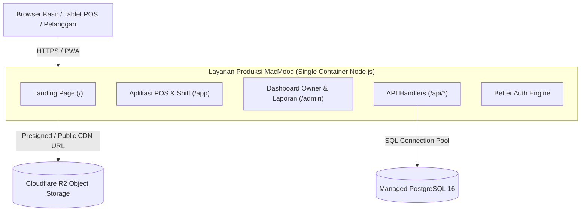

# Panduan Lengkap Deployment Produksi & Arsitektur Cloud MacMood

Dokumen ini adalah panduan teknis resmi untuk merilis aplikasi **MacMood (TanStack Start + PostgreSQL)** ke tingkat produksi (_production-ready_), baik di platform PaaS seperti **Railway** maupun di server mandiri (**Self-hosted VPS** dengan Docker Compose).

---

## 1. Arsitektur Fullstack: Kenapa Cukup 1 Layanan?

Aplikasi MacMood dibangun menggunakan **TanStack Start**:

- **Bukan Frontend Terpisah**: TanStack Start mengkompilasi halaman antarmuka (SSR React), rute API internal (`/api/**`), sesi autentikasi (Better Auth), dan koneksi database Drizzle PostgreSQL ke dalam satu paket server **Nitro (Node.js runtime)**.
- **Tidak Perlu Vercel + Backend Terpisah**: Anda tidak perlu memisahkan frontend di Vercel dan backend di Railway. Satu kontainer di Railway atau VPS sudah melayani seluruh sistem (Landing Page publik di `/`, Kasir POS di `/app`, dan Dashboard Owner di `/admin`).



---

## 2. Manajemen Media & Object Storage (Cloudflare R2)

### Mengapa Bukan Disimpan di Database atau Local Disk Server?

1. **Container Ephemeral**: Di platform seperti Railway atau Docker, kontainer bersifat _ephemeral_ (file lokal di dalam kontainer akan terhapus saat terjadi redeploy atau restart server).
2. **Kesehatan Database**: Menyimpan file gambar binary (BLOB) di dalam PostgreSQL menyebabkan database cepat membengkak, memperlambat _query_, dan membuat proses _backup pg_dump_ menjadi sangat berat.

### Solusi Terbaik: Cloudflare R2 (S3-Compatible)

- **Gratis 10 GB Penyimpanan**: Cloudflare R2 menyediakan 10 GB penyimpanan gratis setiap bulan.
- **Zero Egress Fee**: Berbeda dengan AWS S3 yang membebankan biaya unduhan data per gigabyte, Cloudflare R2 **tidak memungut biaya transfer keluar (egress)**. Sangat ideal untuk katalog foto makanan yang diunduh ribuan kali oleh kasir dan pelanggan.

### Konfigurasi Cloudflare R2:

1. Buka dashboard Cloudflare -> Menu **R2 Object Storage**.
2. Klik **Create Bucket**, beri nama misalnya `macmood-assets`.
3. Buka tab **Settings** bucket -> **Public Access** -> Hubungkan Custom Domain (misal `assets.macmood.id`) atau aktifkan R2.dev subdomain.
4. Buat **R2 API Token** dengan izin _Object Read & Write_.
5. Masukkan credential ke file environment produksi:
   ```env
   R2_ACCOUNT_ID=xxxxxx
   R2_ACCESS_KEY_ID=xxxxxx
   R2_SECRET_ACCESS_KEY=xxxxxx
   R2_BUCKET_NAME=macmood-assets
   R2_PUBLIC_URL=https://assets.macmood.id
   ```

---

## 3. PWA (Progressive Web App) untuk Kasir Outlet

Aplikasi kasir MacMood telah dilengkapi dengan manifest PWA (`/manifest.webmanifest`).

- **Jalan Pintas Langsung Kasir**: `start_url` disetel ke `/app`.
- Ketika staf menginstal aplikasi di tablet Android, iPad, atau PC kasir via tombol _"Tambahkan ke Layar Utama" / "Install App"_, aplikasi akan terbuka secara _standalone_ (tanpa address bar browser) langsung ke layar kasir.
- **Guardrail Autentikasi**:
  - Jika perangkat belum login: dialihkan ke layar Sign In (`/sign-in`).
  - Setelah login: kasir menggunakan fitur **PIN Cepat (4 Digit)** untuk mengunci layar (_Screen Lock_) atau berganti shift antar kasir tanpa perlu login ulang email/password.

---

## 4. Opsi Deployment A: Railway (Direkomendasikan & Paling Cepat)

Railway adalah opsi termudah karena mengelola HTTPS, zero-downtime deploy, dan database PostgreSQL secara otomatis.

### Langkah-langkah:

1. **Buat Proyek Baru di Railway**:
   - Login ke [railway.com](https://railway.com).
   - Klik **New Project** -> Pilih **Provision PostgreSQL**.
2. **Hubungkan Repositori GitHub**:
   - Di proyek yang sama, klik **New** -> **GitHub Repo** -> Pilih repositori `MacMood`.
3. **Atur Variabel Lingkungan (Environment Variables)** di Layanan Web MacMood:
   - `NODE_ENV`: `production`
   - `PORT`: `3000`
   - `DATABASE_URL`: `${{Postgres.DATABASE_URL}}` _(menggunakan variabel referensi bawaan Railway)_
   - `BETTER_AUTH_SECRET`: _String random minimal 32 karakter (jalankan `openssl rand -hex 32`)_
   - `BETTER_AUTH_URL`: Domain Railway Anda, misal `https://macmood-production.up.railway.app` (atau domain kustom Anda).
4. **Deploy & Jalankan Migrasi**:
   - Railway akan secara otomatis mendeteksi `Dockerfile` dan melakukan multi-stage build.
   - Buka tab **Terminal** pada Railway untuk menjalankan migrasi dan menetapkan akun owner:
     ```bash
     npm run db:migrate
     npm run role:set -- owner@macmood.id admin
     ```

---

## 5. Opsi Deployment B: Self-Hosted VPS (Docker Compose)

Jika Anda ingin menjalankan aplikasi di server VPS sendiri (DigitalOcean, Linode, AWS EC2, atau server lokal outlet):

### 1. Prasyarat Server:

- OS: Ubuntu 22.04 LTS / 24.04 LTS atau Debian 12.
- Docker & Docker Compose plugin terpasang:
  ```bash
  sudo apt-get update
  sudo apt-get install -y docker.io docker-compose-plugin
  ```

### 2. Setup Direktori & Environment:

Clone repositori ke server:

```bash
git clone https://github.com/your-org/macmood.git /opt/macmood
cd /opt/macmood
cp .env.production.example .env.production
nano .env.production
```

_Isi password database yang aman dan generate secret auth:_

```bash
openssl rand -hex 32
```

### 3. Jalankan Kontainer Produksi:

```bash
# Build dan jalankan PostgreSQL & App di background
docker compose -f compose.prod.yaml --env-file .env.production up -d --build

# Periksa status kontainer
docker compose -f compose.prod.yaml ps
```

### 4. Terapkan Skema Database & Role Owner:

```bash
docker compose -f compose.prod.yaml exec app npm run db:migrate
docker compose -f compose.prod.yaml exec app npm run role:set -- owner@macmood.id admin
```

---

## 6. Prosedur Backup Database Harian

Untuk melindungi data transaksi finansial kasir, siapkan cronjob backup PostgreSQL otomatis setiap malam di VPS:

```bash
# Buat skrip backup di /opt/macmood/backup.sh
cat << 'EOF' > /opt/macmood/backup.sh
#!/bin/bash
BACKUP_DIR="/opt/macmood/backups"
TIMESTAMP=$(date +"%Y%m%d_%H%M%S")
mkdir -p $BACKUP_DIR
docker exec -t macmood-prod-db pg_dump -U macmood_user macmood | gzip > "$BACKUP_DIR/macmood_db_$TIMESTAMP.sql.gz"
# Hapus backup yang lebih tua dari 30 hari
find $BACKUP_DIR -type f -name "*.sql.gz" -mtime +30 -delete
EOF

chmod +x /opt/macmood/backup.sh
```

Tambahkan ke crontab (`crontab -e`):

```cron
0 3 * * * /opt/macmood/backup.sh > /dev/null 2>&1
```

---

## 7. Rangkuman Akun Pengguna Produksi & Otorisasi

| Nama Lengkap         | Email                   | Peran (RBAC) | Hak Akses Utama                                                                                                                | PIN Layar Kasir |
| :------------------- | :---------------------- | :----------- | :----------------------------------------------------------------------------------------------------------------------------- | :-------------- |
| **Muhammad Afrizal** | `owner@macmood.id`      | `admin`      | Akses penuh: `/admin`, analitik finansial, manajemen HPP & harga, manajemen staf, ekspor laporan, dan POS.                     | `8899`          |
| **Budi Santoso**     | `budi.kasir@macmood.id` | `user`       | Kasir POS: `/app`, transaksi kasir, buka/tutup shift, cetak struk thermal, riwayat antrean offline. Terproteksi dari `/admin`. | `1234`          |
| **Siti Rahma**       | `siti.kasir@macmood.id` | `user`       | Kasir POS: `/app`, transaksi kasir shift siang/malam. Terproteksi dari `/admin`.                                               | `5678`          |
